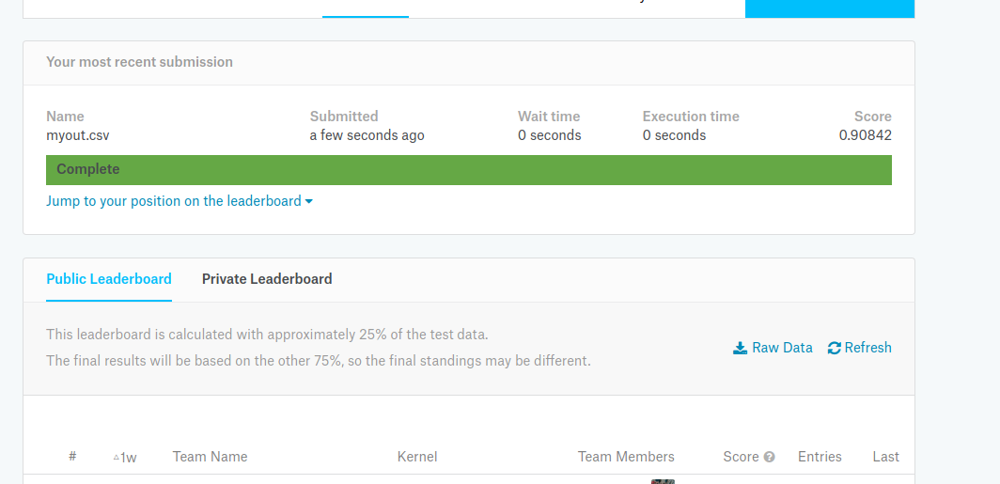

# mnist
csv格式MNIST数据gluon分类demo
    https://www.kaggle.com/c/digit-recognizer

CSV文件有两个,分别是有标记集train.csv和无标记集合test.csv

## mxnet.gluon.data.dataset

读取数据继承自官方[Dataset](https://mxnet.incubator.apache.org/_modules/mxnet/gluon/data/dataset.html#Dataset)
仿照官方[MNIST](https://mxnet.incubator.apache.org/_modules/mxnet/gluon/data/vision/datasets.html#MNIST)源代码写

使用pandas库读取csv文件:

### 核心代码

```python
import os
import sys
import numpy as np
import pandas as pd
from sklearn.model_selection import train_test_split
from sklearn.preprocessing import OneHotEncoder

TRAIN_DATA = 'train.csv'
_TEST_DATA = 'test.csv'
filenames =  [os.path.join(data_dir_,x) for x in [_TRAIN_DATA,_TEST_DATA]]

# get images and labels
labeled_images = pd.read_csv(filenames[0])
validation_images = pd.read_csv(filenames[1])
#
_length = labeled_images.shape[0]
images = labeled_images.iloc[0:_length ,1:] #1:784
labels = labeled_images.iloc[0:_length ,:1] #0:1
images = np.array(images,dtype=dtype)
labels = np.array(labels,dtype=dtype)

train_images, test_images,train_labels, test_labels = train_test_split(images, labels, train_size=0.8, random_state=0)

_length = validation_images.shape[0]
vali_images = labeled_images.iloc[0:_length ,:]
vali_images = np.array(vali_images,dtype=dtype)
```

### 完整代码

[MNISTcsv.py](./MNISTcsv.py)

代码全贴太长了 意思一下
```python
#!/usr/bin/env python3
# -*- coding: utf-8 -*-
"""
Created on Thu Nov 22 22:03:58 2018
@author: bdus

@description:
仿照官方[MNIST](https://mxnet.incubator.apache.org/_modules/mxnet/gluon/data/vision/datasets.html#MNIST)源代码写的csvMNIST
主要是为了熟悉gluon的dataset
"""
import #...
import mxnet as mx
from mxnet.gluon.data import dataset
from sklearn.preprocessing import OneHotEncoder
from sklearn.model_selection import train_test_split


class MNIST_csv(dataset._DownloadedDataset):
    """
    @Description
        create MNIST dataset from csv files.
        https://www.kaggle.com/c/digit-recognizer
    
    @base model 
        mxnet.gluon.data.dataset.Dataset        
        detailed:
        https://mxnet.incubator.apache.org/_modules/mxnet/gluon/data/dataset.html#Dataset
        
    
    """
    def __init__(dasein,data_dir_=os.path.join('./data','csvMNIST'),train=True,one_hot=False,transform=None):        
        dasein.one_hot = one_hot
        dasein._TRAIN_DATA = 'train.csv'
        dasein._TEST_DATA = 'test.csv'
        
        dasein.#...
        
        super(MNIST_csv,dasein).__init__(data_dir_,transform) 
        
    def _get_data(dasein):
        # ....
        dasein._data = np.multiply(images,1.0/255.0)
        # ....
        dasein._label = mx.nd.array(labels,dtype=dasein.dtype)
    
```
## gluon.data.DataLoader


```python
mnist_train = MNIST_csv(train=True)
mnist_val = MNIST_csv(train=False)

train_data = gluon.data.DataLoader(dataset=mnist_train, batch_size=100,shuffle=True,last_batch='discard')
val_data = gluon.data.DataLoader(dataset=mnist_val, batch_size=100,shuffle=False)

```

## train model

[完整 softmax.py](./softmax.py)

[参考了](https://github.com/apache/incubator-mxnet/blob/master/example/gluon/mnist/mnist.py)

```python

#....

# network
net = nn.Sequential()
net.add(
        nn.Dense(10)
        )

loss = gloss.SoftmaxCrossEntropyLoss()
metric = mx.metric.Accuracy()
# train
def test():
    metric = mx.metric.Accuracy()
    #....
    return metric.get()
       
def train(epochs):
    net.initialize(mx.init.Xavier(magnitude=2.24))
    trainer = gluon.Trainer(net.collect_params(),'sgd',{'learning_rate':0.1})
    
    for epoch in range(epochs):
        metric.reset()
        for i, (X, y) in enumerate(train_data):
            #X = nd.array(X)
            #y = nd.array(y)
            with autograd.record():
                output = net(X)
                L = loss(output,y)
                L.backward()
            trainer.step(batch_size)
            metric.update(y,output)            
            
        print #....

if __name__ == '__main__':
    num_epochs = 5
    train(num_epochs)
```
### test

完整代码:[test_model.py](./test_model.py)

[get_data.py](./get_data.py)

参考[link](https://blog.csdn.net/waple_0820/article/details/70049953)

```python
#....

# get model

net = nn.Sequential()
net.add(
        nn.Dense(10)
        )

net.load_parameters('mnist.params')

for i in range(num_test_images):
    X,_ = mnistcsv.validation.next_batch(batch_size)
    X = nd.array(X)
    y = net(X)
    ans = y.argmax(axis=1).asnumpy().astype(np.int8)       
    print("%d-th type %d" % (i, ans))   

# ===================== ====================
img_data = nd.array(mnistcsv.validation.data)
y = net(img_data)
Label = y.argmax(axis=1).asnumpy().astype(np.int8)
Image = np.arange(len(Label)) +1
dataframe = pd.DataFrame({'ImageId':Image,'Label':Label})
dataframe.to_csv("myout.csv",index=False,sep=',')

```

