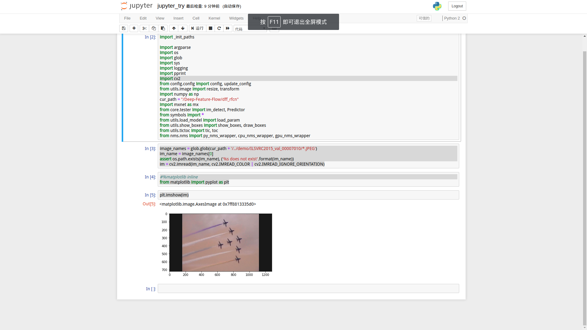

z


```python
import os
import glob
import sys
import cv2
cur_path = "/Deep-Feature-Flow/dff_rfcn"
image_names = glob.glob(cur_path + '/../demo/ILSVRC2015_val_00007010/*.JPEG')
im_name = image_names[0]
assert os.path.exists(im_name), ('%s does not exist'.format(im_name))
im = cv2.imread(im_name, cv2.IMREAD_COLOR | cv2.IMREAD_IGNORE_ORIENTATION)

#%matplotlib inline
from matplotlib import pyplot as plt

plt.imshow(im)
```

```python

img_tmp = None
for idx, im_name in enumerate(image_names):
    assert os.path.exists(im_name), ('%s does not exist'.format(im_name))
    im = cv2.imread(im_name, cv2.IMREAD_COLOR | cv2.IMREAD_IGNORE_ORIENTATION)
    if img_tmp is None:
        img_tmp = plt.imshow(im)
    else:
        img_tmp.set_data(im)
    plt.pause(1)
    plt.draw()
```