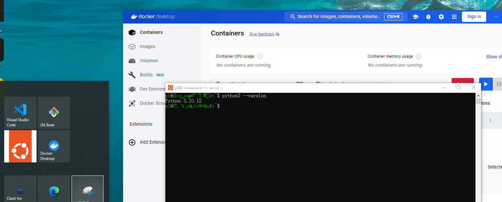
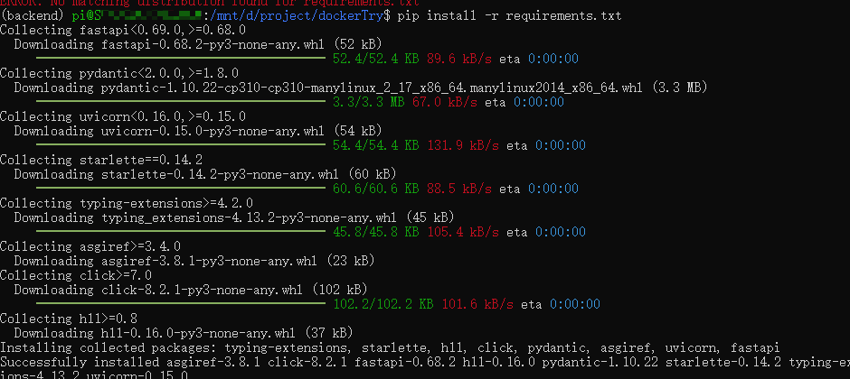
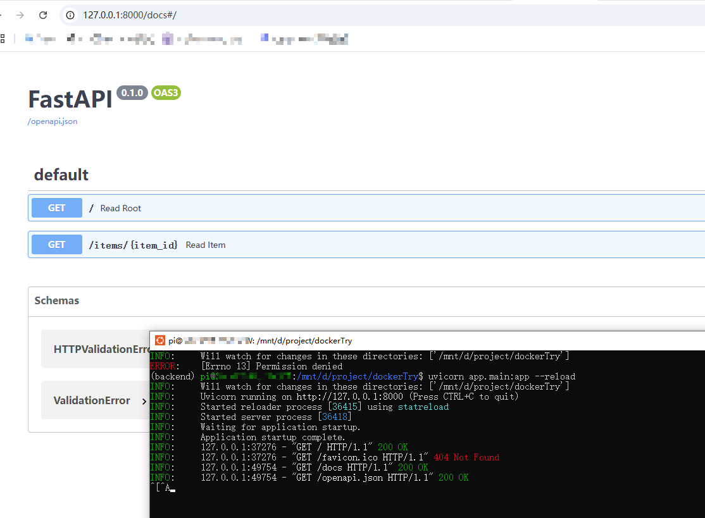
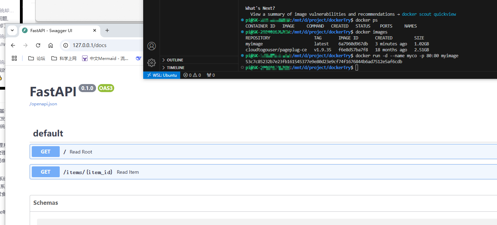

# 基于wsl-docker环境开发python后端实验

## 1. 安装完成docker和wsl环境



## 2. 安装python环境

```
sudo apt install python3-pip
sudo apt install python3-dev
```

## 3. 安装开发环境

创建虚拟环境
> python3 -m venv backend

删除
> rm -rf ./backend

激活虚拟环境
>source backend/bin/activate

退出虚拟环境
> deactivate 

安装pip 依赖

进入虚环境后，命令行前显示虚环境名称
> pip install -r requirements.txt



## 4. 命令行启动服务

```
.
├── app
│   ├── __init__.py
│   └── main.py
├── Dockerfile
└── requirements.txt
```


```python
from typing import Union

from fastapi import FastAPI

app = FastAPI()


@app.get("/")
def read_root():
    return {"Hello": "World"}


@app.get("/items/{item_id}")
def read_item(item_id: int, q: Union[str, None] = None):
    return {"item_id": item_id, "q": q}
```

> uvicorn app.main:app --reload



## 5. 基于docker编译环境

>docker build -t myimage .

>docker run -d --name mycontainer -p 80:80 myimage


